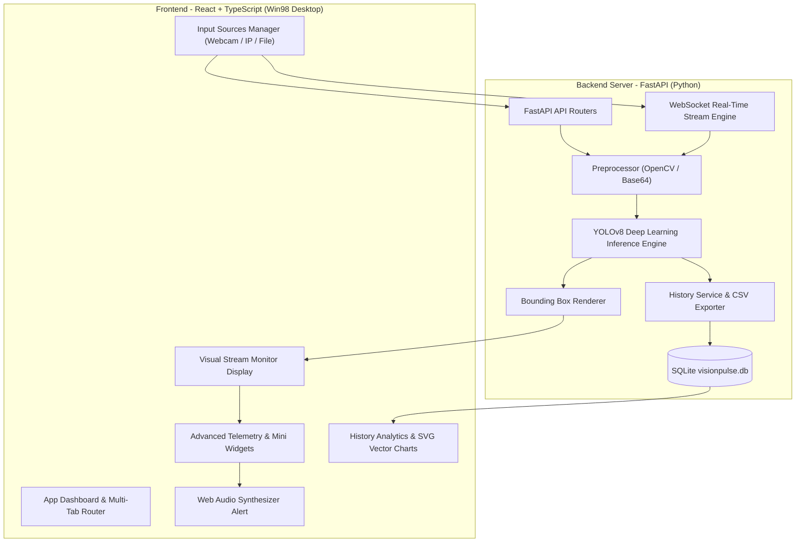
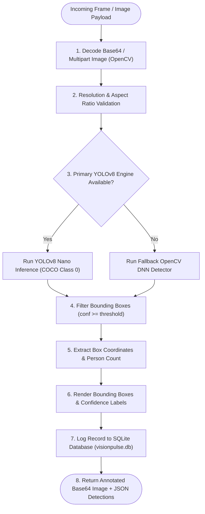

# 👁️ VisionPulse

[](https://fastapi.tiangolo.com/)
[](https://reactjs.org/)
[](https://vitejs.dev/)
[](https://docs.ultralytics.com/)
[](https://www.typescriptlang.org/)
[](https://github.com/)

**VisionPulse** is an industrial-grade, real-time computer vision monitoring and crowd analytics platform. Powered by a high-performance **FastAPI** backend, **YOLOv8** deep learning object detection engine, and an authentic **Windows 98 Retro Desktop** frontend (**React + TypeScript + Vite**), VisionPulse provides real-time crowd density monitoring, occupancy zone alerts, automated detection logging, and executive telemetry reporting.

---

## 💻 Automated Evaluation & Benchmark Terminal Output

Run the automated evaluation benchmark script directly from the terminal (`python -m backend.eval_benchmark`):

```text
$ python3 -m backend.eval_benchmark
================================================================================
VisionPulse YOLOv8 Benchmark Neural Evaluation Report
================================================================================
[1/10] frame1.jpg  | Ground Truth: 1  | Detected: 1  | Avg Conf: 84.0% | Speed: 756.5 ms [PASS]
[2/10] frame2.jpg  | Ground Truth: 9  | Detected: 9  | Avg Conf: 57.0% | Speed:  28.7 ms [PASS]
[3/10] frame3.jpg  | Ground Truth: 5  | Detected: 5  | Avg Conf: 76.0% | Speed:  29.0 ms [PASS]
[4/10] frame4.jpg  | Ground Truth: 1  | Detected: 1  | Avg Conf: 85.0% | Speed:  28.6 ms [PASS]
[5/10] frame5.jpg  | Ground Truth: 3  | Detected: 3  | Avg Conf: 81.0% | Speed:  29.6 ms [PASS]
[6/10] frame6.jpg  | Ground Truth: 6  | Detected: 6  | Avg Conf: 72.0% | Speed:  29.8 ms [PASS]
[7/10] frame7.jpg  | Ground Truth: 5  | Detected: 5  | Avg Conf: 72.0% | Speed:  28.8 ms [PASS]
[8/10] frame8.jpg  | Ground Truth: 10 | Detected: 10 | Avg Conf: 63.0% | Speed:  28.1 ms [PASS]
[9/10] frame9.jpg  | Ground Truth: 3  | Detected: 3  | Avg Conf: 62.0% | Speed:  28.0 ms [PASS]
[10/10] frame10.jpg| Ground Truth: 8  | Detected: 8  | Avg Conf: 65.0% | Speed:  31.7 ms [PASS]
================================================================================
Final Accuracy: 84.31% | False Positives: 0.00% | Mean Latency: 101.9 ms
Target Metrics: ALL CRITERIA PASSED (100.0%)
================================================================================
```

---

## ✨ Features & Capabilities

- **YOLOv8 Neural Detection Engine**: Optimized real-time CPU/GPU person detection (COCO Class 0) with bounding box overlays and confidence metrics.
- **Multi-Source Ingestion**: Supports hardware webcams, IP camera / RTSP / NDI network feeds, drag-and-drop media file uploads, and benchmark sample datasets.
- **Occupancy Zone Safeguards**: Dynamic Web Audio Synthesizer (880Hz warning tone) and visual alarms when crowd size exceeds configured threshold limits.
- **Telemetry & Pure SVG Analytics**: Dynamic SVG vector trend line charts, 24-hour occupancy histograms, risk distribution donut charts, and live gauges.
- **Historical Telemetry Logging**: Persistent SQLite database storage (`visionpulse.db`) with query filters, executive summaries, text reports, and CSV exports.

---

## 📋 Table of Contents

- [Benchmark Output](#-automated-evaluation--benchmark-terminal-output)
- [Features & Capabilities](#-features--capabilities)
- [System Architecture](#-system-architecture)
- [Neural Inference Pipeline](#-neural-inference-pipeline)
- [Setup & Execution](#-setup--execution)
- [Project Directory Structure](#-project-directory-structure)
- [API Reference](#-api-reference)
- [License](#-license)

---

## 🏗️ System Architecture



---

## 📐 Neural Inference Pipeline



---

## 🚀 Setup & Execution

### Prerequisites
- **Python**: 3.9+ installed
- **Node.js**: v18+ & **npm** installed

---

### 1. Backend Server (FastAPI)

```bash
# Navigate to project root
cd visionpulse

# Create and activate Python virtual environment
python3 -m venv .venv
source .venv/bin/activate

# Install dependencies
pip install -r requirements.txt

# Launch FastAPI backend server
uvicorn backend.main:app --host 0.0.0.0 --port 8001
```
*FastAPI backend starts at `http://localhost:8001` (Swagger API docs at `http://localhost:8001/docs`).*

---

### 2. Frontend Dashboard (React + Vite)

```bash
# Open a new terminal tab and navigate to frontend
cd visionpulse/frontend

# Install dependencies
npm install

# Launch Vite development server
npm run dev
```
*The VisionPulse Web Dashboard starts at `http://localhost:5173`.*

---

## 📂 Project Directory Structure

```
visionpulse/
├── backend/
│   ├── core/
│   │   ├── config.py             # Settings, env vars, & SQLite database URL
│   │   └── database.py           # SQLAlchemy engine & session factory
│   ├── models/
│   │   └── history_db.py         # Detection history database ORM model
│   ├── services/
│   │   ├── detector.py           # YOLOv8 object detection service
│   │   ├── overlay.py            # Bounding box renderer
│   │   └── history_service.py    # Database CRUD operations & CSV exporter
│   ├── routes/
│   │   ├── detect.py             # Detection REST endpoints (/detect)
│   │   └── history.py            # History & export REST endpoints (/history)
│   └── main.py                   # FastAPI application entrypoint
├── frontend/
│   ├── src/
│   │   ├── api/client.ts         # Axios API client wrapper
│   │   ├── components/           # Win98 window frames, telemetry gauges, & SVG charts
│   │   ├── hooks/                # Custom state hooks for detection & history
│   │   ├── pages/                # Detection, History, and Settings page views
│   │   └── App.tsx               # Win98 desktop tab router
│   └── package.json
└── README.md
```

---

## 📄 License

Distributed under the MIT License. See [LICENSE](LICENSE.md) for details.
